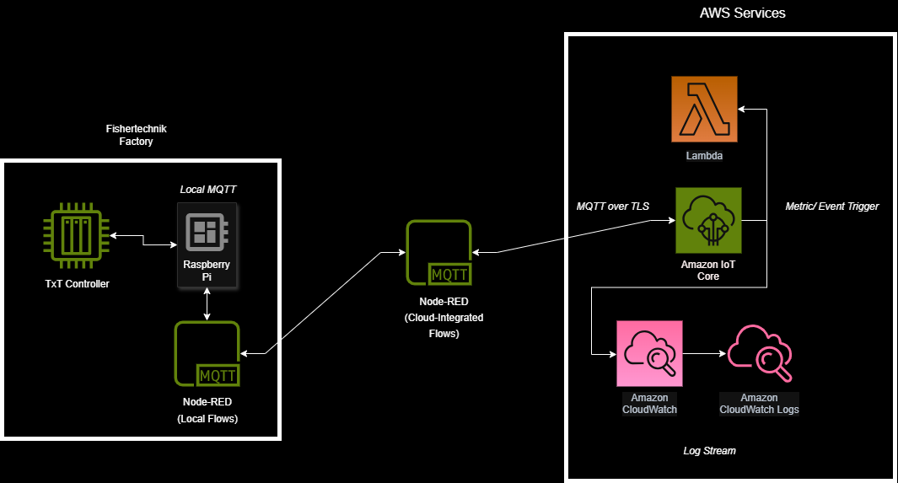

# Fischertechnik Factory Cloud Integration


## Table of Contents
- [Introduction](#introduction)
- [System Architecture Overview](#system-architecture-overview)
- [Factory Metrics and Variables](#factory-metrics-and-variables)
- [Node-RED Flows and Cloud Messaging](#node-red-flows-and-cloud-messaging)
- [MQTT Communication Setup](#mqtt-communication-setup)
- [AWS IotCore Integration](#aws-integration)
- [AWS Lambda & CloudWatch Integration](#aws-lambda--cloudwatch-integration)
- [Debug Output Examples (Node-RED)](#debug-output-examples-node-red)
- [Future Work and Next Steps](#future-work-and-next-steps)
- [Appendices](#appendices)

## Introduction
This project documents the integration of a Fischertechnik factory model with AWS services using MQTT communication protocols. The goal is to enable cloud-based control, monitoring, and visualization of the factory's operations using Node-RED as the integration platform.

## System Architecture Overview
The system uses MQTT to transmit factory data between the cloud and the physical factory. Node-RED serves as the central control logic for parsing, transforming, and routing messages.

Parts of the factory's original Python control logic (such as the structure of NFC payloads in `Nfc_MQTT.py`) were used as a **template** when building the Node-RED message flows. Although the Python code was not executed directly, its logic for publishing NFC data (including fields like `workpiece.id`, `type`, `state`, and `ts`) and using topics like `fl/i/nfc/ds` served as the conceptual basis for how Node-RED receives, processes, and publishes messages.

### Factory Control Options:
The factory accepts only the following workpiece color types as valid order inputs:
- `RED`
- `BLUE`
- `WHITE`

## System Architecture



### System Components

1. **Factory Hardware (TxT Controller & Sensors):**  
   Executes physical actions (e.g., moving items) and detects events like NFC scans or stock changes.

2. **Raspberry Pi (connected via USB to TxT Controller):**  
   Acts as the bridge between physical components and the software layer. Publishes and receives MQTT messages via Node-RED.

3. **Local Node-RED (on Raspberry Pi):**  
   Orchestrates local logic. Converts sensor events into MQTT messages and routes commands to the TxT Controller.

4. **Cloud-Connected Node-RED:**  
   Subscribes to local MQTT topics and relays telemetry to AWS IoT Core using secure MQTT over TLS. Also receives cloud commands and forwards them to the local broker.

5. **AWS IoT Core:**  
   Cloud-based MQTT broker that securely transmits messages between the factory system and AWS services.

6. **Amazon CloudWatch Logs and Metrics:**  
   Logs MQTT payloads for debugging and updates dashboards with factory telemetry (e.g., stock, order status).

7. **AWS Lambda:**  
   Executes cloud-side logic in response to telemetry (e.g., parsing events, sending alerts, or future automation triggers).

---

### Message Flow and Protocols

1. **Factory to Raspberry Pi:**  
   - **Connection:** USB serial or GPIO (physical interface)  
   - **Purpose:** Transmit factory events (e.g., sensor states) to the Pi for processing.

2. **Raspberry Pi to Local MQTT Broker:**  
   - **Protocol:** MQTT  
   - **Purpose:** Publishes telemetry (e.g., stock levels, NFC scans) to Node-RED for local processing and forwarding.

3. **Local Node-RED to Cloud-Connected Node-RED:**  
   - **Protocol:** MQTT (within the same network)  
   - **Purpose:** Shares internal factory messages for cloud forwarding.

4. **Cloud-Connected Node-RED to AWS IoT Core:**  
   - **Protocol:** MQTT over TLS  
   - **Purpose:** Securely transmits factory telemetry to the cloud.

5. **AWS IoT Core to CloudWatch:**  
   - **Integration:** Native AWS integration  
   - **Purpose:** Logs MQTT payloads and updates metrics for visualization.

6. **AWS IoT Core to Lambda (optional):**  
   - **Trigger:** MQTT message or metric threshold  
   - **Purpose:** Executes automation logic or processing routines.

7. **Cloud to Factory (AWS IoT Core → Node-RED → Factory):**  
   - **Protocol:** MQTT over TLS (cloud to Pi), then local MQTT (to factory)  
   - **Purpose:** Sends commands (e.g., test messages) from cloud to the TxT Controller for physical execution.

## Factory Metrics and Variables

### MQTT-Based Metrics (Used in Node-RED)

| Metric / Variable     | Description |
|------------------------|-------------|
| `order.type`           | The color of the piece being ordered (`RED`, `BLUE`, `WHITE`). Sent from cloud to factory via `f/o/order`. |
| `order.ts`             | ISO-formatted UTC timestamp when the order was sent. |
| `nfcReader`            | Reports detection of piece IDs and states. Each message includes `workpiece.id`, `ts`, and a status like `PLACED` or `REMOVED`. |
| `workpiece.location`   | Factory sends warehouse item positions (e.g., `a1`, `b3`) for cloud tracking after matching with scanned NFC tag. |

### MQTT Topics in Use

#### Inbound (Messages Received by Node-RED from Cloud or Factory)

| Topic                 | Description |
|-----------------------|-------------|
| `factory/control`     | Orders sent from AWS to Node-RED in the form `{ "type": "RED" }`. |
| `fl/i/nfc/ds`         | NFC scan events from the factory. Contains `workpiece.id`, `type`, `state`, and `ts`. |
| `f/i/stock`           | Current stock layout from the factory, used to match scanned NFC tags. |

#### Outbound (Messages Sent from Node-RED to Factory or AWS)

| Topic                     | Description |
|---------------------------|-------------|
| `f/o/order`               | Formatted order messages (type + timestamp) sent to the factory to begin processing. |
| `factory/warehouse/state` | Result of NFC+stock match sent to AWS IoT Core. Contains `type`, `location`, and `ts`. |

## Node-RED Flows and Cloud Messaging

### Flow 1: AWS-to-Factory Order Flow
**Flow Name:** `Ashley_MQTT Factory Control`  
**Purpose:** Allows AWS to trigger factory orders based on color selection.

#### Components:
- `mqtt in (factory/control)`: Listens to AWS for an order message (`{ "type": "RED" }`).
- `function (Parse AWS Stock Order)`: Formats color and adds a timestamp.
- `switch (Which Color to Order?)`: Branches logic based on `RED`, `BLUE`, or `WHITE`.
- `function (Log RED/BLUE/WHITE Order)`: Logs outgoing order in debug sidebar.
- `mqtt out (f/o/order)`: Sends message to the local broker to control the factory.

### Flow 2: Factory-to-AWS Warehouse Flow
**Flow Name:** `Ashley_MQTT Cloud Recieve`  
**Purpose:** Correlates NFC scan data with current warehouse stock to track workpiece locations.

#### Components:
- `mqtt in (fl/i/nfc/ds)`: Receives the latest scanned UID from the NFC reader.
- `function (Store Last Scanned UID)`: Stores UID temporarily for comparison.
- `mqtt in (f/i/stock)`: Receives current stock layout from the factory.
- `function (Match UID and Publish)`: Matches scanned UID to warehouse item and formats a payload `{ type, location, ts }`.
- `mqtt out (factory/warehouse/state)`: Publishes matched result to AWS IoT Core.
- `debug`: Displays final cloud message in the debug sidebar.

## MQTT Communication Setup

- Configured AWS IoT Core MQTT broker credentials and TLS certificates.
- Connected AWS topics to Node-RED using secure MQTT input/output nodes.

## AWS Integration

**AWS IoT Core**:
- Fully integrated into the final system.
- Serves as the secure MQTT broker for communication between AWS and Node-RED.
- Receives incoming cloud orders and publishes factory updates.

## AWS Lambda & CloudWatch Integration

**AWS Lambda**:
- Lambda was used during development for testing message handling logic, even without access to the live factory.
- Lambda function `iotdataprocessor` processes messages sent to AWS IoT Core topics such as `factory/warehouse/state`.
- When it receives a message with `status: "stored"`, it sends a custom CloudWatch metric (`ItemsStored`) with a `Color` dimension.

**Lambda Metric Code Snippet:**
```javascript
if (payload.status === "stored") {
  const metric = new PutMetricDataCommand({
    Namespace: "Factory",
    MetricData: [
      {
        MetricName: "ItemsStored",
        Dimensions: [{ Name: "Color", Value: payload.color || "unknown" }],
        Unit: "Count",
        Value: 1
      }
    ]
  });
  await cloudwatch.send(metric);
}
```

**AWS CloudWatch**:
- Metrics sent by Lambda appear under the `Factory` namespace.
- Metrics are visualized in CloudWatch using graphs, filtered by the `Color` dimension.
- A line graph widget was added to a dashboard to track how many workpieces of each color were stored over time.
- This metric tracking works without needing the physical factory, by publishing test messages through the AWS IoT Core MQTT test client.

**CloudWatch Graph Configuration:**
- **Metric Name**: `ItemsStored`
- **Namespace**: `Factory`
- **Dimension**: `Color=white`, `Color=red`, `Color=blue`, etc.
- **Statistic**: `Sum`
- **Period**: `1 minute`
- **View**: Line graph in a CloudWatch dashboard
- **Refresh time**: Metric data typically appears within 1–2 minutes of publishing a valid message

**Testing Instructions:**
1. Go to **AWS IoT Core → MQTT test client**
2. Publish the following message to the topic: `factory/warehouse/state`
```json
{
  "location": "b2",
  "color": "white",
  "status": "stored"
}
```
3. Go to **CloudWatch → Logs → `/aws/lambda/iotdataprocessor`** to verify that Lambda processed the message and logged
4. Then, go to **CloudWatch → Metrics → Custom → Factory → ItemsStored**
5. Select the `Color = white` metric and add it to a graph with the following settings:

- **Statistic:** `Sum`
- **Period:** `1 minute`
- **Time range:** `Last 5–15 minutes`

6. Once the message is published and the metric appears, the line graph will update to reflect the count.
>Tip: Publish multiple messages in a row to see the graph trend over time.


## Debug Output Examples (Node-RED)

The following are real debug logs captured from **Node-RED**, showing how the system processes NFC tag scans and publishes matched warehouse state messages to AWS IoT Core. These logs are visible in the Node-RED debug sidebar and were used to verify correct factory behavior and cloud messaging during development.

```plaintext
5/2/2025, 5:02:02 PM  node: Match UID and Publish
function : (warn)
"UID not matched: 044270ca341290"

5/2/2025, 5:02:04 PM  node: Match UID and Publish
function : (warn)
"UID not matched: 044270ca341290"

5/2/2025, 5:02:07 PM  node: Match UID and Publish
function : (warn)
"Matched UID: 044270ca341290"

5/2/2025, 5:02:07 PM  node: AWS Payload Debug
f/i/stock : msg.payload : Object
{
  type: "white",
  location: "c1",
  ts: "2025-05-03T00:02:06.486Z"
}
```

## Progress Documentation

| Date | Progress Made | Challenges Faced | Next Steps |
|------|----------------|------------------|------------|
| 2/3 | Started the factory and successfully logged in using GitHub credentials. Connected using a personal hotspot. Confirmed the camera was fully functional and connected to the laptop. | Did not know how to properly use or SSH into the factory. Buttons on web interface unresponsive. Factory displayed "project running was stopped" error. | Ask for help connecting to cloud. Request a factory walkthrough. Ask about proper shutdown procedures. |
| 2/13 | Met with Bobby to learn factory commands. Discussed cloud integration possibilities. Completed a 1-hour Node.js tutorial. | Persistent networking issues even after switching Wi-Fi. | Contact Bryle about error logs. Contact Justin about cloud code. Finish Node.js tutorial and start AWS API Gateway tutorial. |
| 2/17 | Discussed current factory issues. | See Progress Made. | Learn MQTT protocol. Attempt Node-RED connection. Investigate Node-RED to factory communication. Review Discord/GitHub resources. |
| 2/19 | Node-RED successfully connected with live updates and no errors. | Camera continually moving left unnecessarily. | Focus on MQTT communication setup. |
| 2/19 (Research) | Researched MQTT GitHub repo. Learned Node-RED and Mosquitto basics. | Cannot proceed with MQTT until AWS server is set up. Hosting payment concerns. | Confirm AWS free tier with Dony. Finish Node.js tutorial. Begin AWS EC2 setup. |
| 2/25 | Confirmed AWS free tier eligibility. Finished Node.js tutorial. Completed AWS account setup. | Needed to input credit card for AWS signup. | Review EC2 needs. Proceed with EC2 setup if needed. |
| 3/3 | Project check-in. | None. | Continue project tasks. |
| 3/4 | AWS root/user accounts created. EC2 server up and running. | Billing confusion. Realized Lambda needed instead of EC2. | Set up AWS IoT Core and Lambda. |
| 3/5 | AWS Lambda setup complete. Started AWS IoT Core and MQTT bridge setup. | Ran out of time to SSH into TXT controller. | SSH into controller. Transfer certificates. Finalize MQTT broker setup. Integrate IoT Core with Lambda. |
| 3/11 | Attempted AWS IoT Core connection using certificates. | Lack of root access to factory device. | Obtain root username/password. Prepare USB backup. |
| 3/18 | Focused on alternative methods to move forward without full credentials. | Still awaiting factory credentials. | Simulate IoT Core in Lambda. Continue Lambda work until lab access. |
| 3/24 | Built Lambda functions without factory connection. Researched MQTT broker setups. Investigated Grafana for visualization. | Limited by lack of factory access. Confusion around AWS Lambda billing. | Review Lambda billing. Continue Lambda preparation. |
| 3/25 | Set up Lambda and CloudWatch monitoring (OrdersProcessed, RawMaterialsOrdered). Built a basic CI/CD pipeline for testing. | Difficulty filtering CloudWatch metrics. Uploading files to Lambda required troubleshooting. | Set up CloudWatch metrics for NFC reader. Sync AWS setup with GitHub. |
| 3/27 | SSH connection to factory established. Certificates manually transferred. Custom MQTT bridge config created. Node-RED selected as MQTT publisher. | SCP failed due to PowerShell quoting issues. No sudo access. Could not run Mosquitto manually. | Fully integrate Node-RED MQTT bridge. |
| 4/7 | Factory connected to AWS IoT Core via Node-RED. Test MQTT messages confirmed in AWS. | Troubles configuring certificates and policies correctly. | Publish messages from all factory systems. Integrate data into CloudWatch and Lambda. |
| 4/9 | Node-RED test flow reconnected. Lambda processed messages. CloudWatch metrics (OrdersProcessed, RawMaterialsOrdered, StockSlotsFilled) added. | Lambda initially lacked CloudWatch metric publishing permissions. | Add PTU movement and station activity metrics. Improve dashboard visualization. Plan automation. |
| 4/14 | Reviewed progress with factory data input. Discussed automation and dashboard improvements. | Uncertainty starting the factory manual. | Start writing manual. Choose manual creation tool (Markdown, Google Docs, etc.). |
| 4/23 | Focused on NFC reader integration, cloud-to-factory messaging, and manual creation. | See Progress Made. | Contact Fabian. Complete system manual. |
| 4/24 | Collaborated with Fabian. Fixed Node-RED IP address issue causing cloud-to-cloud messaging loop. | See Progress Made. | Ensure Node-RED connects properly to the factory. Continue manual development. |

## Future Work and Next Steps

### Real-Time Tracking
- Expand the system to support full real-time tracking of all moving components in the factory.
- Prioritize MQTT communication using AWS IoT Core and Node-RED for core functionality.
- Reevaluate AWS Lambda and CloudWatch as optional add-ons for future automation or metric logging.

### Graphical User Interface (GUI)
- Develop a cloud-connected GUI for intuitive part ordering and factory monitoring.
- Grafana is a strong candidate due to its dashboard customization and integration with cloud services, but alternative solutions are being considered.

### Error Handling
- Implement logic to detect and manage common errors such as:
  - Invalid or duplicate part orders.
  - Workpieces incorrectly discarded in the garbage bin.

### Scalability Considerations
- Prepare for higher message throughput as more devices and features are integrated.
- Actively monitor AWS Free Tier usage and adapt architecture to remain cost-effective as the system scales.

## Appendices
- [ ] [Factory-4.0-Guide GitHub](https://github.com/BoostedJ/Factory-4.0-Guide?tab=readme-ov-file)
- [ ] [MQTT Interface Fischertechnik GitHub](https://github.com/fischertechnik/txt_training_factory/blob/master/TxtSmartFactoryLib/doc/MqttInterface.md)
- [ ] [Login Credentials (Google Doc)](https://docs.google.com/document/d/1PxL4VxPzMO6FwuO9nOJwjydyvzU8517Sn3vGIZw0giA/edit?usp=sharing)
- [ ] Useful links:
  - [AWS IoT Core Documentation](https://docs.aws.amazon.com/iot/latest/developerguide/what-is-aws-iot.html)
  - [Node-RED Documentation](https://nodered.org/docs/)
  - [MQTT Protocol Specification](http://mqtt.org/)

